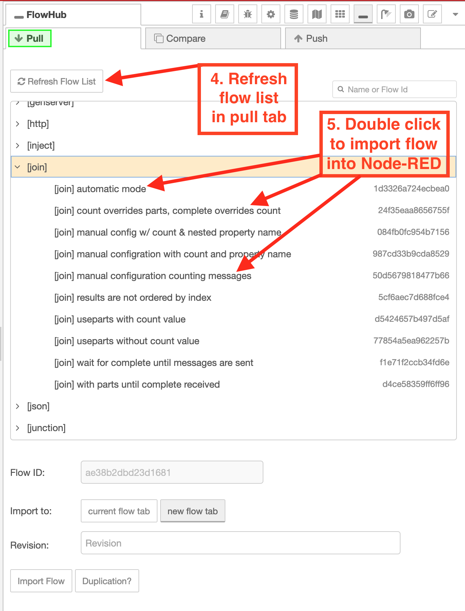

# TADSummit - Erlang-Red diameter examples

Examples used for the TADSummit presentation.

Part of the [Erlang-Red](https://github.com/gorenje/erlang-red) Project: Visual Flpw Based Programming for Erlang inspired by [Node-RED](https://nodered.org).

## Access via FlowHub.org

Direct access to this repository is possible:

- from within Node-RED or Erlang-Red via the [FlowHub](https://flows.nodered.org/node/@gregoriusrippenstein/node-red-contrib-flowhub) nodes
- [Erlang-Red online instance](https://ered.fly.dev/erlang-red)
- [Browser-Red serverless Node-RED instance](https://deadred.openmindmap.org)

Using the following read-only token:

```
fhb_WyJmNmNOek00VmkwWFZSd0txd2loMUFnPT0iLCJTQWdDejd0bEtNQnh2VlU4U2VCc05GUlUzYWgyZkhGS2xwTjZLbDVjcFhKYzJjd3Qvbm05T0ZMeE02NS9LRVVvSnovaWNzVVZUR1BSV0VYS0dkcmdzYUJVRVBQV044bXBodU9URVdlZ280Y01SNkJTVmt5TXRYcDFYVzRhYTRqa2k3SitrdE1VUHdSc3h3cHNZWTQ1SWJFaGdIcjBMcnBVZ1drZVpZWTdRUVlqKzhYSTByblJtQ0tpQzJBTUU2VXlocW9pZnIxY0VhQ3BhVzh3RlA1alArOGoxeXNpQkpzMHZiQT0iXQ
```


How to add the token to the FlowHub nodes:


Then open the pull tab to refresh the test suite list:



Double clicking on any test flow will import that flow.

This token also works in the [browser-only serverless](https://deadred.flowhub.org) version of Node-RED, for those who do not wish to install Node-RED.
